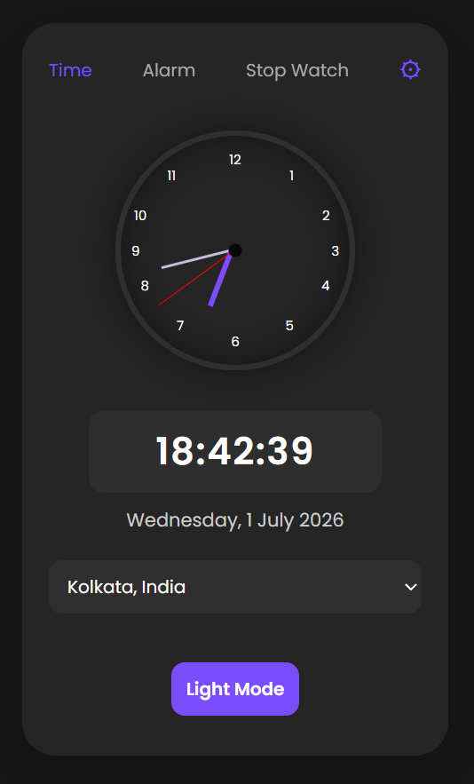
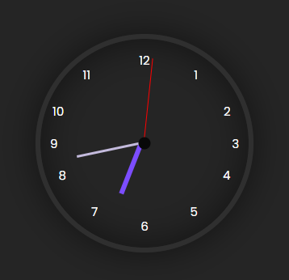
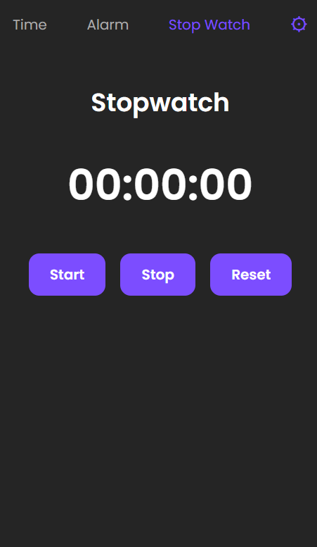
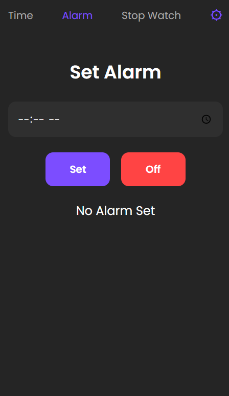

# Smart Clock

<p align="center">
  
</p>

<p align="center">
  
  
  
  
</p>

---

# 📖 About

Smart Clock is a modern web application that combines a **Digital Clock**, **Analog Clock**, **Alarm**, **Stopwatch**, and **Global Timezone Selection** into one responsive interface.

The application allows users to select a city from different time zones around the world and instantly displays the correct local time.

This project helped me gain practical experience with:

- JavaScript Date Object
- DOM Manipulation
- Fetch API
- Async JavaScript
- Responsive Web Design
- Timezone APIs

---

# Live Demo

🔗 **Website:** https://smartclockzonaltime.netlify.app/

---

# ✨ Features

- 🌍 Global Timezone Support
- 🕒 Analog Clock
- ⏰ Digital Clock
- 🔔 Alarm
- ⏱ Stopwatch
- 🌙 Modern Dark Theme
- 📱 Responsive Design
- ⚡ Real-time Updates

---

# 📷 Screenshots

## Home Page



---

## Analog Clock



---

## Stopwatch



---

## Alarm



---

# 🛠 Tech Stack

| Technology | Purpose |
|------------|---------|
| HTML5 | Structure |
| CSS3 | Styling |
| JavaScript | Functionality |
| Time API | Timezone Data |
| Netlify | Deployment |

---

# 📂 Folder Structure

```
Smart-Clock/
│
├── images/
│
├── index.html
├── style.css
├── script.js
│
└── README.md
```

---

# ⚙️ Installation

Clone the repository

```bash
git clone https://github.com/yourusername/Smart-Clock.git
```

Open the folder

```bash
cd Smart-Clock
```

Open

```text
index.html
```

in your browser.

---

# 🎯 Usage

1. Open the website.

2. Choose your preferred timezone.

3. View Digital Clock.

4. View Analog Clock.

5. Start Stopwatch.

6. Set Alarm.

---

# 🔄 Project Workflow

```
User

      │

      ▼

Select Timezone

      │

      ▼

JavaScript Fetch API

      │

      ▼

Time API

      │

      ▼

Receive JSON

      │

      ▼

Update Clock

      │

      ▼

Display Time
```

---

# 🔌 API Used

This project uses a Time API to fetch real-time timezone information.

```
User

↓

Select City

↓

Fetch API

↓

Time API

↓

JSON Response

↓

Display Current Time
```

---

# 📚 What I Learned

✅ JavaScript Date Object

✅ Fetch API

✅ Async / Await

✅ DOM Manipulation

✅ Event Handling

✅ Responsive Design

✅ Timezone Conversion

---

# 🚧 Challenges

During development, I faced several challenges such as:

- Managing different timezones
- Updating the clock every second
- Synchronizing analog and digital clocks
- Implementing alarm logic
- Creating an accurate stopwatch
- Working with asynchronous API requests

---

# 💻 Author

**Dipan Mondal**

GitHub: https://github.com/Coder-Dipan

LinkedIn: https://linkedin.com/in/your-profile


---

# ⭐ Support

If you like this project, please give it a ⭐ on GitHub!

---

# 📜 License

This project is licensed under the MIT License.
